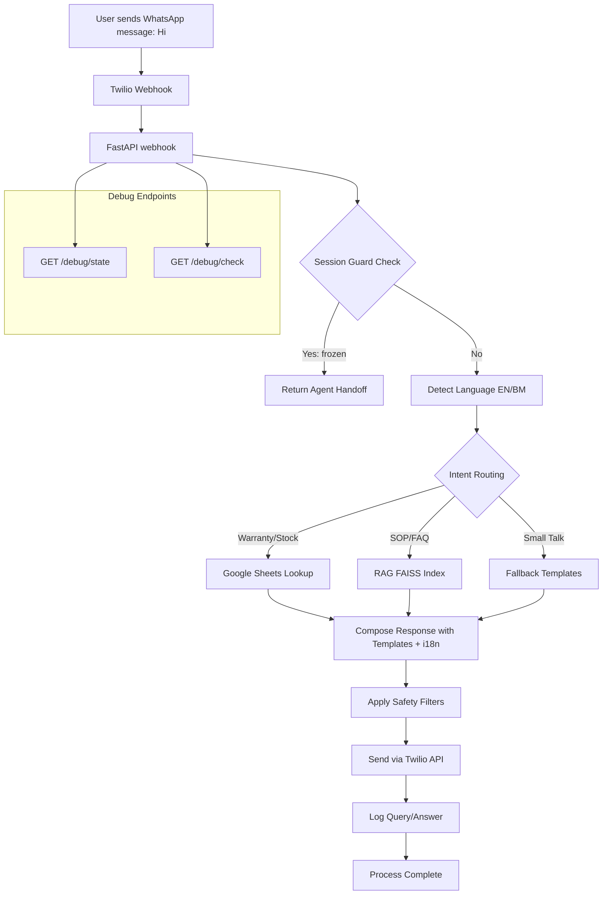

# Kai Kommu ChatBot  

An AI-powered assistant for **Kommu**.  
Designed to handle customer and internal support queries with **speed, accuracy, and bilingual support (English & Malay)**.

---

##  Features

- **RAG (Retrieval-Augmented Generation):** SOP + chat logs indexed with FAISS  
- **Google Sheets Integration:** Warranty & stock lookups  
- **Multi-language:** English ↔ Bahasa Melayu auto-switching  
- **WhatsApp Integration (via Twilio)**  
- **Daily Auto-Refresh** of SOP & Google Sheets  
- **Debug, Health & Benchmark Tools** to test coverage and performance  

---

##  Setup

### 1) Clone & prepare environment

```bash
# Clone
git clone https://github.com/Jetsaw/Kai_Kommu_ChatBot.git
cd Kai_Kommu_ChatBot

# (Recommended) Python 3.10–3.12
python -m venv .venv
# Windows
.venv\Scripts\activate
# macOS / Linux
# source .venv/bin/activate

# Install deps
pip install -r requirements.txt
```

### 2) Configure environment

Create a `.env` file:

```bash
# Minimal required (examples)
OPENAI_API_KEY=sk-xxxxxxxxxxxxxxxxxxxxxxxx
GOOGLE_SHEETS_CREDENTIALS_JSON=./secrets/google_service_account.json
WARRANTY_SHEET_ID=your_warranty_google_sheet_id
SOP_DOC_URL=https://docs.google.com/document/d/xxxxxxxxxxxxxxxxxxxx
TWILIO_AUTH_TOKEN=xxxxxxxxxxxxxxxxxxxxxxxx
TWILIO_ACCOUNT_SID=ACxxxxxxxxxxxxxxxxxxxx
```

Or hardcode in `config.py`.

### 3) Run locally

```bash
# App (FastAPI + uvicorn)
uvicorn app:app --host 0.0.0.0 --port 8000
# Health check
curl http://127.0.0.1:8000/
```

### 4) Run with Docker

```bash
docker compose up -d
# health
curl http://127.0.0.1:6090/
```

Exposed endpoints (in Docker):

- `http://127.0.0.1:6090/webhook`  
- `http://127.0.0.1:6090/fallback`  
- `http://127.0.0.1:6090/status_callback`  
- `http://127.0.0.1:6090/debug/state`  
- `http://127.0.0.1:6090/debug/check`  

---

## 🔧 Twilio WhatsApp Webhooks (Production)

| Twilio Field       | URL                               |
|--------------------|-----------------------------------|
| Webhook            | `https://api.kommu.ai/webhook`    |
| Fallback URL       | `https://api.kommu.ai/fallback`   |
| Status Callback    | `https://api.kommu.ai/status_callback` |

---

##  Debug & Health Checks

### A) One-shot full system check (CLI)

```bash
python debug_check.py
```

Expected output:

```
[SOP-DOC] Loaded 50 Q/A from Google Doc and rebuilt RAG.
[WARRANTY] Loaded total rows: 476; 308 unique dongle ids; 98 phone/serial keys.
[HEALTH] All templates OK.
[LANG] Detector ready (EN/BM).
[OK] System is ready.
```

### B) Runtime checks (HTTP)

```bash
# Lightweight OK/NOT OK
curl http://127.0.0.1:6090/debug/check

# Inspect pinned language, sessions, cache
curl http://127.0.0.1:6090/debug/state
```

### C) Test webhook manually

```bash
curl -X POST http://127.0.0.1:6090/webhook   -H "Content-Type: application/json"   -d '{"from":"+6000000000","text":"Hi, what cars are supported?"}'
```

---

##  Daily Auto-Refresh

Script path: `/home/deployment-user/bin/kai-refresh.sh`

Cron (every day 9:00 AM):

```bash
0 9 * * * /home/deployment-user/bin/kai-refresh.sh >> /home/deployment-user/kai-refresh.log 2>&1
```

Run manually:

```bash
/home/deployment-user/bin/kai-refresh.sh
tail -n 200 /home/deployment-user/kai-refresh.log
```

---

##  How the Chatbot Works (High-Level)

The diagram below illustrates the **end-to-end workflow** of the Kai Kommu ChatBot. It begins when a user sends a message via WhatsApp. The message flows through Twilio into the FastAPI webhook, where session management, language detection, and intent routing take place. Depending on the intent, the bot either performs a Google Sheets lookup (for warranty/stock), queries the RAG index (for SOP/FAQs), or falls back to templates (for small talk or unsupported cases). A response is then composed with internationalization (i18n) support, passed through safety filters, sent back to the user via Twilio, and logged for future analysis. Debug endpoints allow health and state checks during runtime.



---

##  Repo Layout

```bash
├── app.py                    # FastAPI app
├── config.py                 # Config + constants
├── data/sop/                 # SOP docs
├── rag/                      # FAISS index files
├── tools/                    # Audits & benchmarks
├── logs/                     # Runtime & benchmark logs
├── docker-compose.yml
├── Dockerfile
├── requirements.txt
└── README.md
```

---


##  Troubleshooting

- `curl 127.0.0.1:8000` fails → ensure `uvicorn app:app` is running.  
- In Docker, use **6090** not 8000.  
- SOP outdated → run `python debug_check.py`.  
- Always “live agent” → unfreeze via `/debug/state`.  
- Wrong language → check pinned language.  
